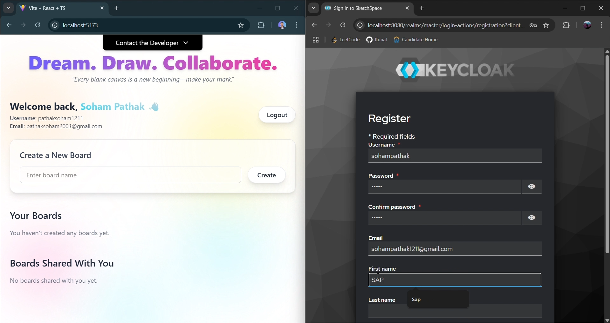
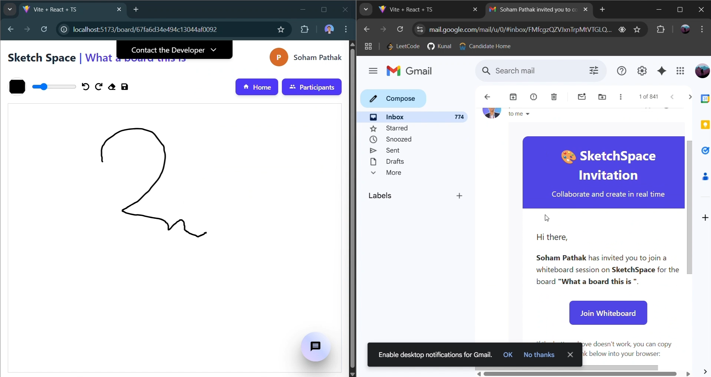
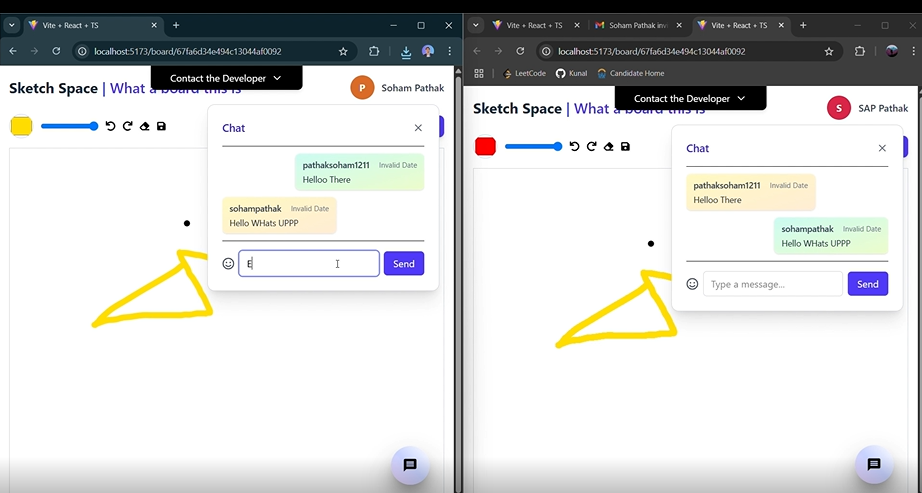

## 🎥 Watch the Demo

Check out a walkthrough of the application in action:  
👉 [Watch the Demo on YouTube](https://youtu.be/trEFBZ-9VIU)

## 🚀 To setup the project locally follow GETTING_STARTED (Click the link below)

To set up the project on your local machine:  
👉 [Getting Started Guide](./GETTING_STARTED.md)

---

### 🛡️ Keycloak Authentication

### 🎨 Created Boards and Shared Boards

### ✏️ Email Invitation in Action

### 💬 Real-time Chat

